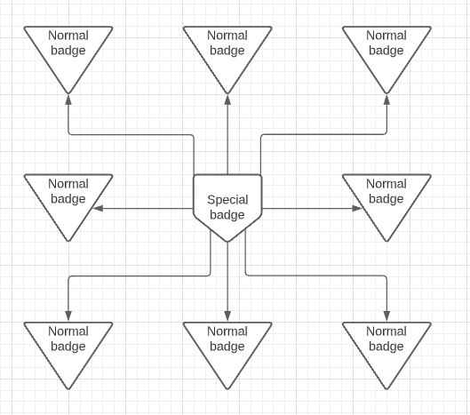
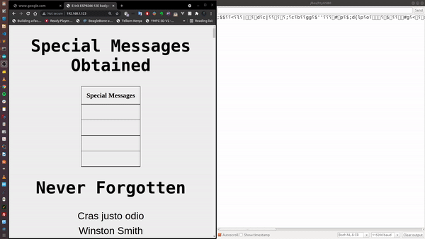
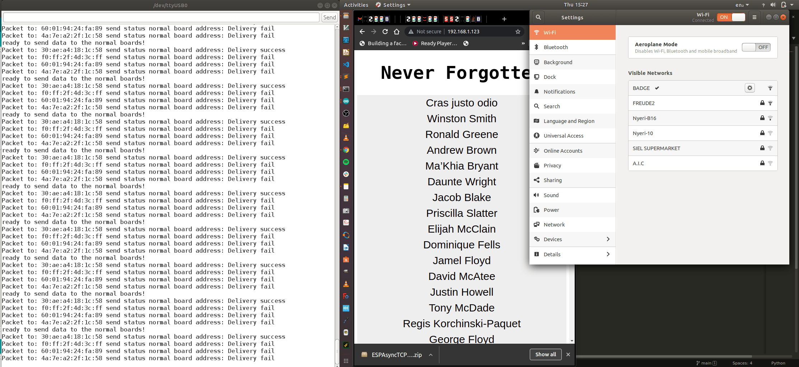

  

# E-Ink ESP8266-12E Badges
## Hardware 

1. ESP8266-12E 
2. Waveshare 2.9" E-ink display

|   </img>  |      </img>     |
|:----------------------------------------------------------------:|:-----------------------------------------------------------------------:|
| </img> | </img> |
 
## Folder structure
	   .
	   ├── docs # Documentation directory
	   ├── Firmware # Firmware directory
	   ├── images   # Images directory
	   └── README.md
## System architecture and working
### 1. Mesh Network and webservers

</img>

ESP-NOW communication protocol was used to send special names one special badge to multiple normal boards in a cluster(one to many). All devices are set to be both as a Station and Soft Access Point simultaneously. The normal badges run an Async Web Server that is updated once the onRecv espnow callback function runs to show the special messages obtained from the on the webserver 'dashboard'. Essentially a cluster in the network has 4 special badges, every special badge has a special name that it transmits to a maximum of 20 unencrypted normal badge peers and the normal badges store these special names and display the same on their webservers  

Heres a short demo of the normal badge webserver updating the special names table on espnow message receive from a special badge: 

The special badges run a legacy web server that only displays a list of victims at the hands of police in the US
</img>
