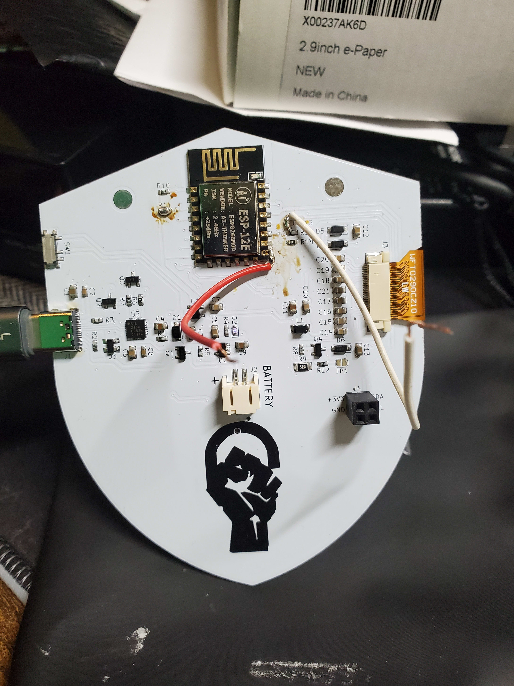
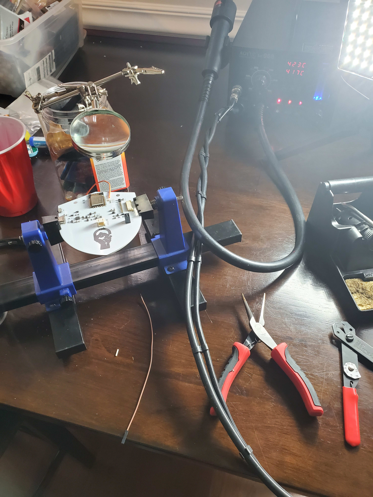
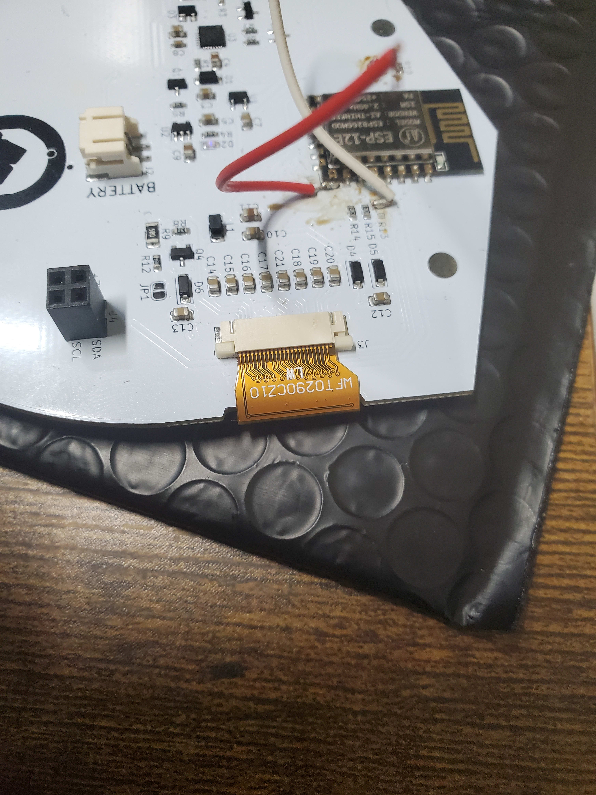

  

<h1 align="center">
  Black Lives Matter
</h1>

# E-Ink ESP8266-12E Badges
## Hardware 
1. ESP8266-12E 
2. Waveshare 2.9" E-ink display

|   </img>  |      </img>     |
|:----------------------------------------------------------------:|:-----------------------------------------------------------------------:|
| </img> | </img> |
 
## Folder structure
	   .
	   ├── docs # Documentation directory
	   ├── Firmware # Firmware directory
	   ├── images   # Images directory
	   └── README.md
